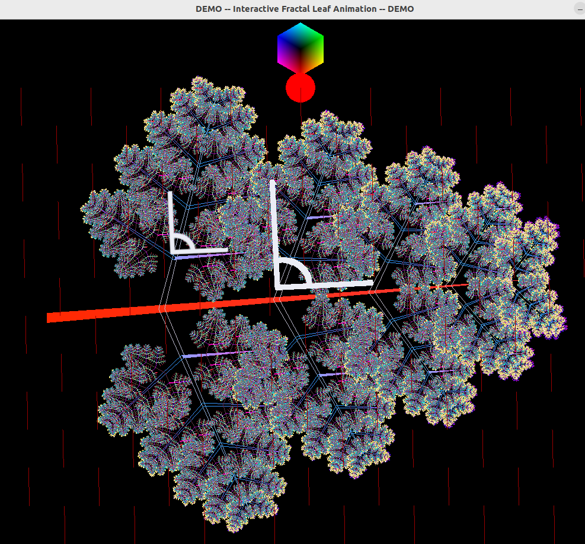
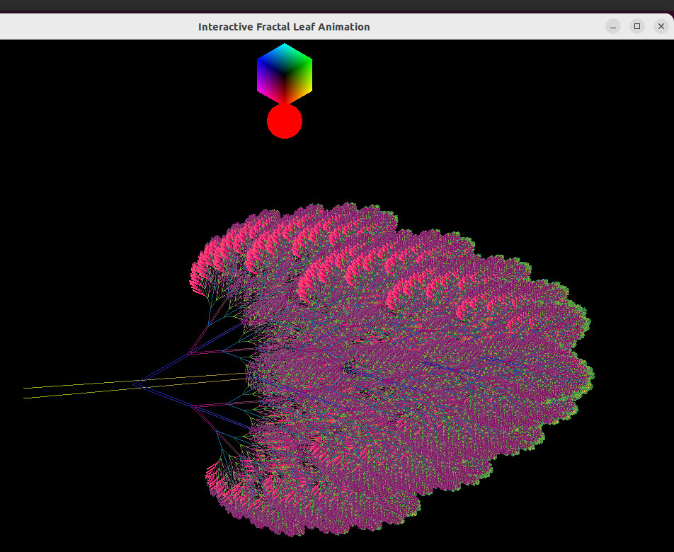
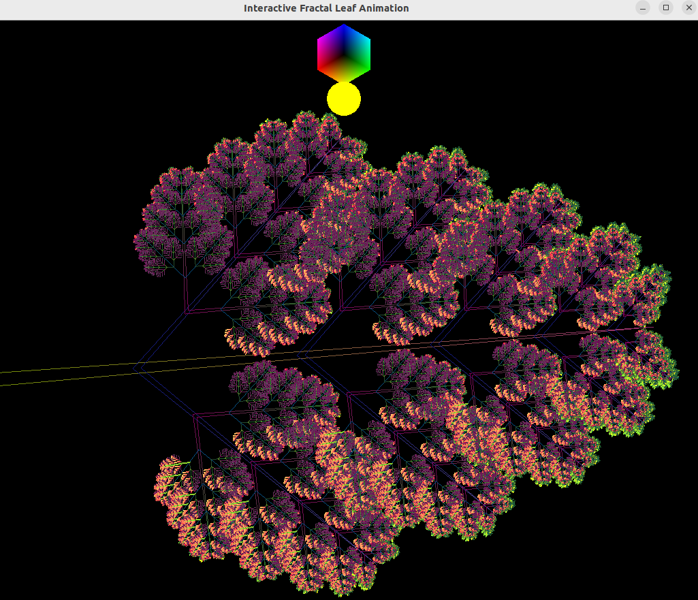

# fractal-anim

**Playing with:** Graphics, fractals, colors, animation.  
**Exploring:** SFML (a 2D graphics library), C++, recursion, Meson (build system).  

## The Idea  
The idea is to draw 2D **fractal leaf** based on first element and set of transformation rules
applied in recursion to draw next (generation) elements.
By gradually varying these rules, an animated effect can be achieved.  

To enhance the visual appeal, a simulated beam of light—modeled as parallel rays (as if from a distant source)—adds dynamic color effects. When a ray passes perpendicularly through an element, that element is briefly highlighted (specifically, its base color component matching the light's color is intensified). 
Think of this as a simplified light reflection simulation.  

Since both the light source (which can move and change color) and the fractal leaf (which transforms and rotates its elements) are in motion, the result is a mesmerizing flow of shimmering highlights across the structure.  



### Possible effects


## Dependencies
- SFML (https://www.sfml-dev.org/) - to be installed manually before;
- lyra (c++ arg parser) - embedded as subproject (see https://github.com/bfgroup/Lyra for source).
## Installation
Clone GitHub project
### Using meson
Ii is recommended to use Meson build system as it verifies dependencies,
enables automatic configuration and explicit installation.
``` shell
mkdir build-mes-release/
meson setup build-mes-release/
cd build-mes-release/
meson compile
meson configure --prefix=$HOME/.local  # optionally for linux LOCAL installation
meson install # optionally to explicitly install
```
### Using make
It is also possible to use make with included Makefile:
- edit config.h.in manually in src/ and change file name to config.h
``` shell
mkdir build # from project root
make release
```
## Running
To check available options:
``` shell
[./]frexe --help
```
Might be worth to try demo:
``` shell
[./]frexe --demo
```
F1 - to display available key actions.
## Modification and adaptation
To modify and test changed code I would recommend to
use separate build directory (ex. build-mes-dev/) containing modified build settings instance:
``` shell
meson setup build-mes-dev/
cd build-mes-dev/
meson configure --buildtype=custom --optimization=2
```
This will switch on asserts and extensive logging.

Alternatively one can use 
`make all`.
